# 🚗 AUTO-TRACK

> 🚀 **GOING PUBLIC VERY SOON! — v2.0 launch is almost here. Star ⭐ this repo to get notified on release day!**

[](LICENSE)
[](https://github.com/SAM0-0/AUTO-TRACK)
[](https://github.com/SAM0-0/AUTO-TRACK/releases)
[](https://github.com/SAM0-0/AUTO-TRACK)
[](#-document-storage--privacy-first)

**Your all-in-one vehicle companion app.** Effortlessly manage vehicle records, track fuel & EV charging logs, monitor PUC / RC / Insurance, store important documents securely, and look up comprehensive vehicle info — all in one place.

No spreadsheets. No forgotten expiry dates. No guessing EV recharge amounts. Just open AUTO-TRACK.

---

## 📑 Table of Contents

- [✨ Why AUTO-TRACK?](#-why-auto-track)
- [📸 Screenshots](#-screenshots)
- [🎯 Features](#-features)
  - [1. 🔍 Vehicle Lookup](#1--vehicle-lookup)
  - [2. 🧾 Service Records](#2--service-records)
  - [3. 🔔 Smart Reminders](#3--smart-reminders)
  - [4. ⛽ Fuel Price Tracking](#4--fuel-price-tracking)
  - [5. 📁 Document Storage & Privacy](#-document-storage--privacy-first)
  - [6. 💸 Expenses & Bills](#6--expenses--bills)
  - [7. 📄 Detailed Export Reports](#7--detailed-export-reports)
  - [8. 📊 Spending Analytics](#8--spending-analytics)
  - [9. 🔋 EV Charging Calculator](#9--ev-charging-calculator)
  - [10. ⚡ Charging Session Tracker](#10--charging-session-tracker)
  - [11. 💾 Backup & Restore](#11--backup--restore)
  - [12. 🛣️ Mileage Prediction](#12--mileage-prediction)
- [🔋 Built for EV Owners](#-built-for-ev-owners)
- [🔒 Privacy First](#-privacy-first)
- [📲 Installation](#-installation)
- [🗺️ Roadmap](#️-roadmap)
- [🤝 Contributing](#-contributing)
- [📜 License](#-license)
- [📬 Contact](#-contact)
- [⚠️ Disclaimer](#️-disclaimer)

---

## ✨ Why AUTO-TRACK?

Most car apps do **one** thing — fuel tracking, or service history, or document storage.

**AUTO-TRACK does it all:**

| Problem | AUTO-TRACK Solution |
|---------|---------------------|
| "When does my PUC / Insurance expire?" | Smart Reminders auto-fetch + alert you — no manual date entry |
| "Where are all my service bills?" | Organized service records + expense bills with photos |
| "How much am I *really* spending on my car?" | Beautiful graphs + bar charts for fuel, service & total spend |
| "How much should I recharge in this EV app for 80%?" | EV Charging Calculator tells you the exact ₹ amount |
| "Any pending challans / fines on this vehicle?" | Instant e-Challan check with clean-record status |
| "Where are my RC / Insurance / PUC papers?" | Secure on-device document vault + one-tap share |
| "I need full history for resale" | One-tap detailed export report |
| "What mileage is my car really giving?" | Automatic mileage prediction from your fuel logs |
| "What if I lose my phone / change phones?" | One-tap Backup & Restore — all your data, safe with you |

---

## 📸 Screenshots

| Garage Dashboard | Search Vehicle | My Vehicles |
|:---:|:---:|:---:|
| 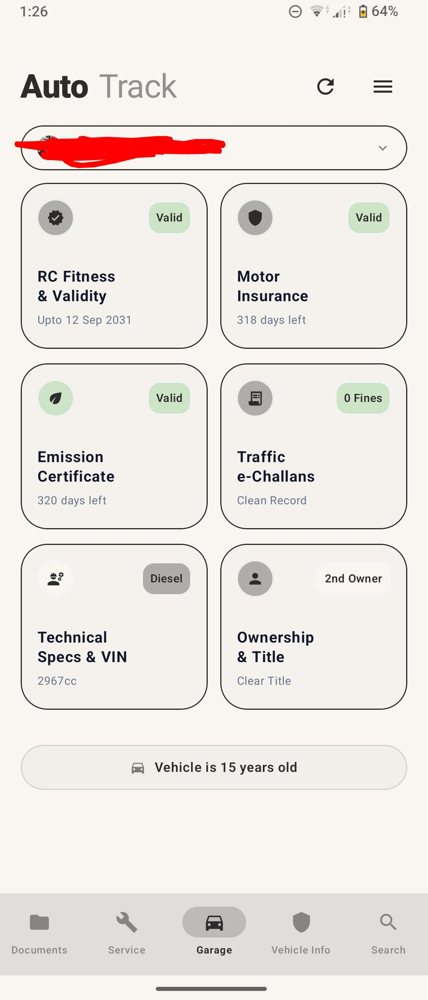 | 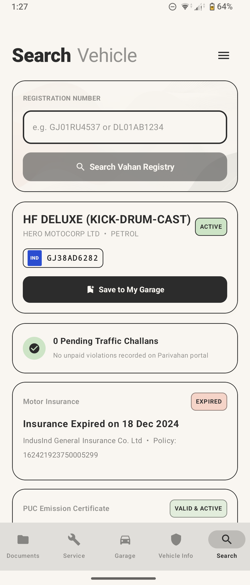 | 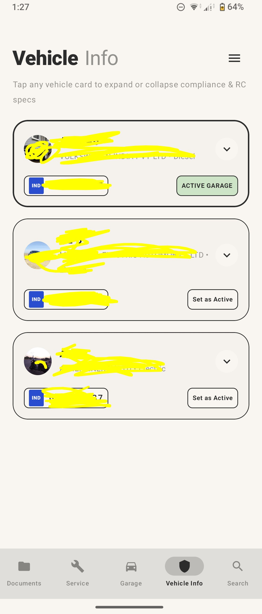 |

| RC Fitness Detail | Insurance Detail | Technical Specs |
|:---:|:---:|:---:|
| 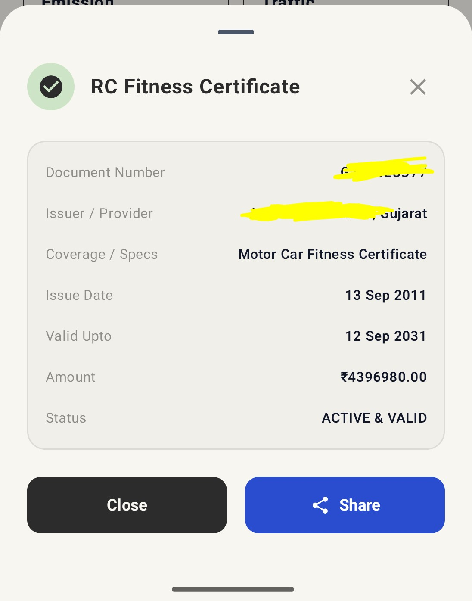 | 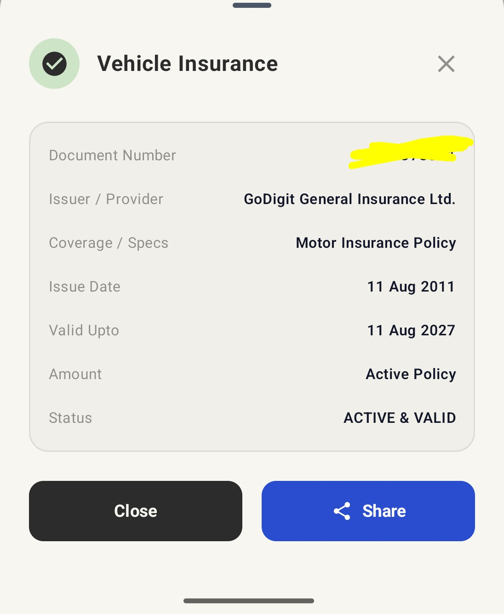 | 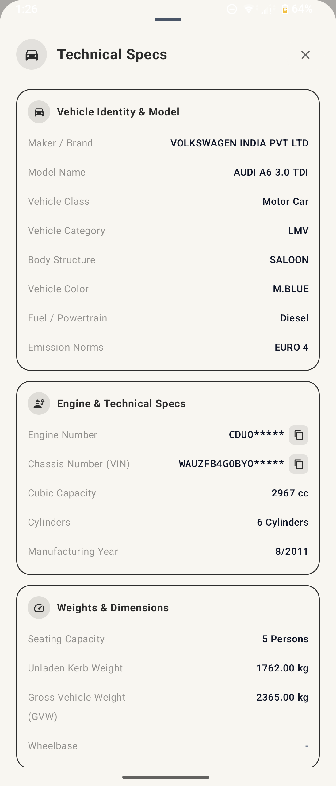 |

| Service + Analytics | Fuel Info + Mileage | Documents Vault |
|:---:|:---:|:---:|
| 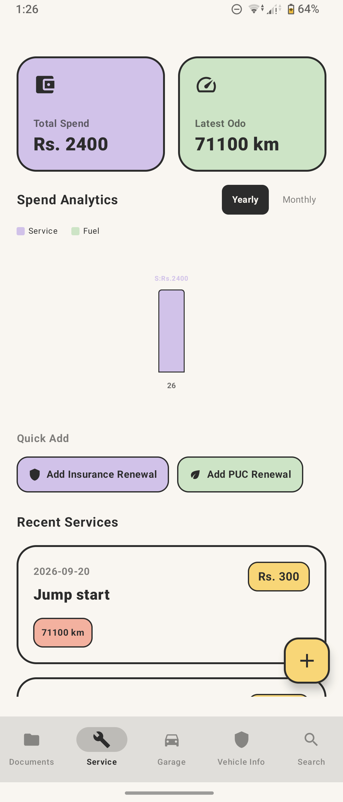 | 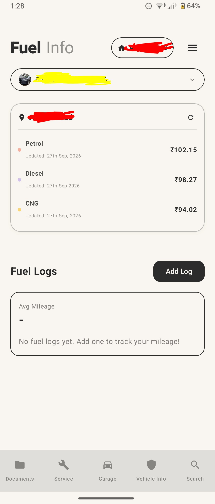 | 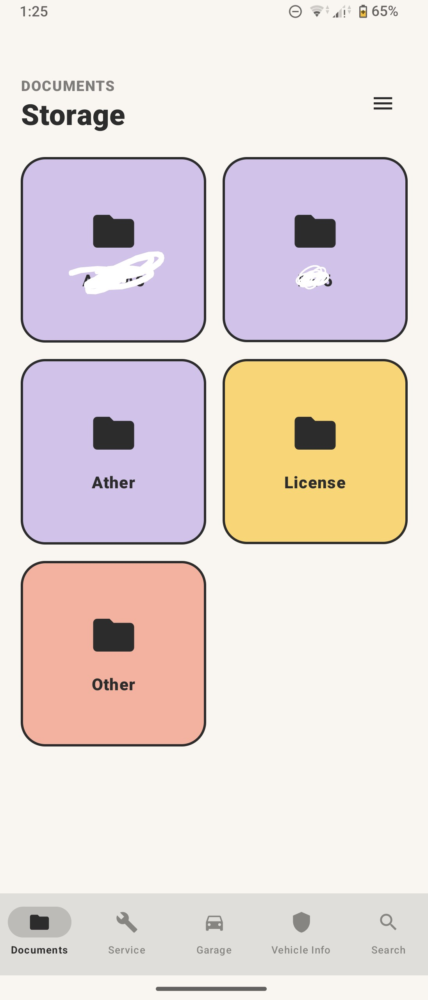 |

| EV Charging Calculator | Backup & Export |
|:---:|:---:|
| 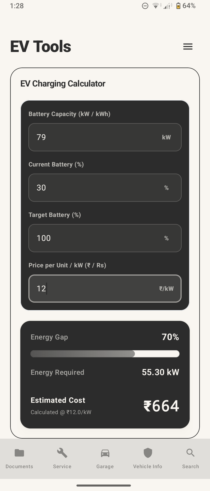 | 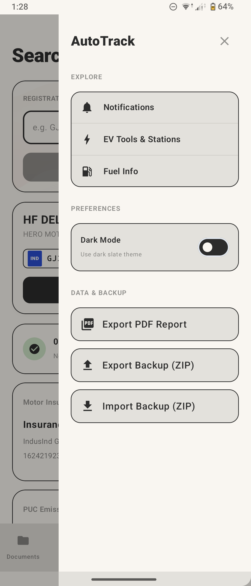 |

---

## 🎯 Features

### 1. 🔍 Vehicle Lookup

Search complete vehicle information **just by entering the registration number**.

- Instant lookup — owner details, registration, fuel type, RTO & more*
- **Traffic e-Challan / fines check** — see pending challans and clean-record status right on the result
- Perfect before buying a used car or verifying details
- Clean, readable result cards — no clutter

### 2. 🧾 Service Records

Your car's complete health history, forever organized.

- Log every service: date, odometer, service center, work done, cost
- Attach bills / photos for proof
- Full timeline per vehicle — ideal for resale value

### 3. 🔔 Smart Reminders

Never miss a critical date again — **with zero manual setup**.

- Automatically fetches data from the server (PUC, Insurance, RC, etc.)
- Checks validity and **reminds you before expiry**
- No need to add dates manually — it just works in the background

> Example: Your PUC expires in 7 days? AUTO-TRACK already knows and nudges you.

### 4. ⛽ Fuel Price Tracking

Daily fuel prices, tracked automatically.

- See **today's fuel prices automatically** — updated every day
- When you log a fill-up, prices are saved with the entry automatically
- Track mileage, fuel efficiency & fuel spend over time

### 5. 📁 Document Storage & Privacy-First

Your glovebox, digitized — and 100% private.

- Store RC, Insurance, PUC, Driving License, bills & more
- **One-tap share** when traffic police / RTO / buyer asks
- 🔒 **Nothing goes to any server at all. Everything stays on your phone, locally, all the time. 0 data collection.**

### 6. 💸 Expenses & Bills

Every rupee, accounted for.

- Store **all service records, expense bills & misc costs** in one proper ledger
- Categorize: service, fuel, insurance, accessories, repairs, challans, etc.
- Attach bill images so you never lose a receipt again

### 7. 📄 Detailed Export Reports

Generate a **professional, detailed report of your car** in seconds.

- Includes services, fuel logs, expenses, documents summary & more
- Perfect for **resale, insurance claims, or personal records**
- Share as PDF / file with buyers or family

### 8. 📊 Spending Analytics

See exactly where your car money goes.

- **Detailed summary of total spend** on car + fuel
- Beautiful **graphs, pie & bar charts** — monthly / yearly / category-wise
- Spot overspending and plan better: fuel vs service vs extras

### 9. 🔋 EV Charging Calculator

> Tired of juggling 5 different charging apps and guessing recharge amounts?

Just enter:
- Your car's **battery capacity (kWh)**
- The **per-kWh price** of that network

➡️ AUTO-TRACK tells you the **exact ₹ amount to add** to charge to e.g. 80%.

No over-adding. No locked wallet money. No math.

### 10. ⚡ Charging Session Tracker

For EV owners, a dedicated logbook:

- Track every **charging session**: date, location/network, kWh added, cost
- Monitor charging costs vs time
- Combine with analytics to see true cost-per-km of your EV

### 11. 💾 Backup & Restore

Your entire garage, safe — no matter what happens to your phone.

- **One-tap backup** of vehicles, services, fuel logs, expenses, documents & settings
- **Easy restore** on a new phone or after reinstall — back up and running in minutes
- Your backup file stays **with you** — private, local, under your control

### 12. 🛣️ Mileage Prediction

Know your real mileage — automatically predicted from your fuel logs.

- Calculates **fuel efficiency & predicted mileage** from your fill-ups + odometer readings
- Helps you spot drops in mileage early (low tyre pressure? service due? driving style?)
- Works alongside fuel tracking + analytics for true cost-per-km

---

## 🔋 Built for EV Owners

| Feature | How it helps |
|---------|--------------|
| 🔋 EV Charging Calculator | Exact recharge amount for any % target on any network |
| ⚡ Charging Session Tracker | Full history of sessions + prices |
| 📊 Cost Analytics | True running cost, cost/km, home vs public charging split |
| 🔔 Reminders | Insurance / PUC (where applicable) still auto-tracked |

ICE, Hybrid, CNG or EV — AUTO-TRACK adapts to your vehicle type.

---

## 🔒 Privacy First

- 📱 **100% on-device storage** for documents, bills, logs & personal data
- 🚫 **Nothing goes to any server at all. Everything remains on your phone, locally, all the time.**
- 📊 **0 data collection. Period.**
- 👀 You control what you share, when you share it — one-tap share only when *you* choose to

---

## 📲 Installation

> 🚀 **Going public very soon!** v2.0 APK + source code drop together on launch day — grab it from [Releases](https://github.com/SAM0-0/AUTO-TRACK/releases) when it lands.

⭐ **Star + Watch this repo** so you get notified the moment v2.0 drops.

```bash
# Once public, cloning + running (devs):
git clone https://github.com/SAM0-0/AUTO-TRACK.git
# + project-specific setup instructions will be added here
```

---

## 🗺️ Roadmap

- [x] Vehicle lookup by registration number
- [x] Service records + expense bills
- [x] Smart auto reminders
- [x] Daily fuel price tracking
- [x] On-device document vault
- [x] Export reports + spending charts
- [x] EV calculator + charging tracker
- [x] Backup & Restore
- [x] Mileage prediction from fuel logs
- [ ] v2.0 Public Release 🚀
- [ ] Multi-vehicle garage support improvements
- [ ] Service predictions

Have an idea? [Open an issue](https://github.com/SAM0-0/AUTO-TRACK/issues) — we'd love to hear it.

---

## 🤝 Contributing

AUTO-TRACK is going public very soon, and contributions will open with v2.0!

1. Fork the repo
2. Create a feature branch (`git checkout -b feature/amazing-feature`)
3. Commit (`git commit -m 'Add amazing feature'`)
4. Push + open a Pull Request

Please be nice, keep PRs focused, and add screenshots for UI changes.

---

## 📜 License

Distributed under the **MIT License**. See [LICENSE](LICENSE) for details.

---

## 📬 Contact

**Maintainer:** [@SAM0-0](https://github.com/SAM0-0)

- 🐛 Bugs / 💡 Features: [Issues](https://github.com/SAM0-0/AUTO-TRACK/issues)
- ⭐ Updates: [Releases](https://github.com/SAM0-0/AUTO-TRACK/releases) (v2.0 coming soon!)
- 📦 Repo: `https://github.com/SAM0-0/AUTO-TRACK`

If AUTO-TRACK saves you time or money, please **star the repo** — it hugely helps an indie launch! ⭐

---

## ⚠️ Disclaimer

- Vehicle information depends on third-party / government data sources and availability.
- Fuel prices are indicative and may vary slightly by city / pump.
- This app is a personal organizer — not a legal / RTO authority.

---

<p align="center">
  <b>🚗 AUTO-TRACK — Every car deserves a track record.</b><br/>
  🚀 Going public very soon. Stay tuned!
</p>
